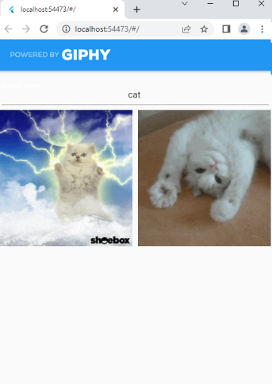

# gif_search

An application I made using Flutter to search for GIF images using Giphy API.




### Final result!


## [GET YOUR API KEY! developers.giphy.com](https://developers.giphy.com)

:exclamation::exclamation::exclamation: go to /lib/Pages/home_page.dart <br/>
:exclamation::exclamation::exclamation: add your api-key to '\_key' variable

### What is Flutter?

Flutter us UI toolkit, to reach multi-platform applications from a single codebase, for all screen sizes and devices.

- [youtube.com/c/Londonappbrewery](https://www.youtube.com/watch?v=I9ceqw5Ny-4) (explained in simple video)
- [wikipedia.org/Flutter](<https://en.wikipedia.org/wiki/Flutter_(software)>)
- [Widget catalog](https://docs.flutter.dev/development/ui/widgets)

### What is Giphy?

Giphy, is an American online database and search engine that allows users to search for and share short looping videos with no sound.

- [wikipedia.org/Giphy](https://en.wikipedia.org/wiki/Giphy)

###### What is API and how it works?

- [giphy.com/api](https://developers.giphy.com/docs/api)
- [How to Use the Giphy API](https://www.youtube.com/watch?v=HRh6zHRwRLo)
- [The Giphy API and JavaScript, by 'The Coding Train'](https://www.youtube.com/watch?v=mj8_w11MvH8)

Using api link we get acces to json file format, from it you can acces link and display it on your phone screen or in browser.

Lets say you sent request using api query link, and got back json file format. In my app I am accessing link from data['data'][index]['images']['fixed_height'] ['url'] **_(where [index] = item in 'data' list)_**

We get direct image url, and aplication or browser helps us it display on our screens.

```
{
   "data":[
      {
         "type":"gif",
         "rating":"g",
         "images":{
            "fixed_height":{
               "height":"200",
               "width":"200",
               "url":"https://media4.giphy.com/media/BzyTuYCmvSORqs1ABM/200.gif?cid=bd3f1be23ravmnb1kd2hwlkioduk7d6cw5vp3ecdc22vu32b&rid=200.gif&ct=g"
            }
         }
      }
   ]
}
```

## Getting Started with Flutter

This project is a starting point for a Flutter application.
A few resources to get you started if this is your first Flutter project:

- [Lab: Write your first Flutter app](https://docs.flutter.dev/get-started/codelab)
- [Cookbook: Useful Flutter samples](https://docs.flutter.dev/cookbook)

For help getting started with Flutter development, view the
[online documentation](https://docs.flutter.dev/), which offers tutorials,
samples, guidance on mobile development, and a full API reference.

TO-DO:
change title image and it's link

packages installed:<br/>
`flutter pub add http`<br/>
`flutter pud add transparent_image`<br/>
`flutter pud add share`
